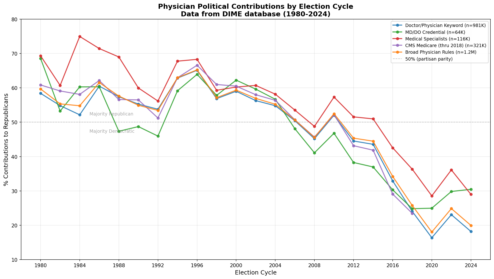
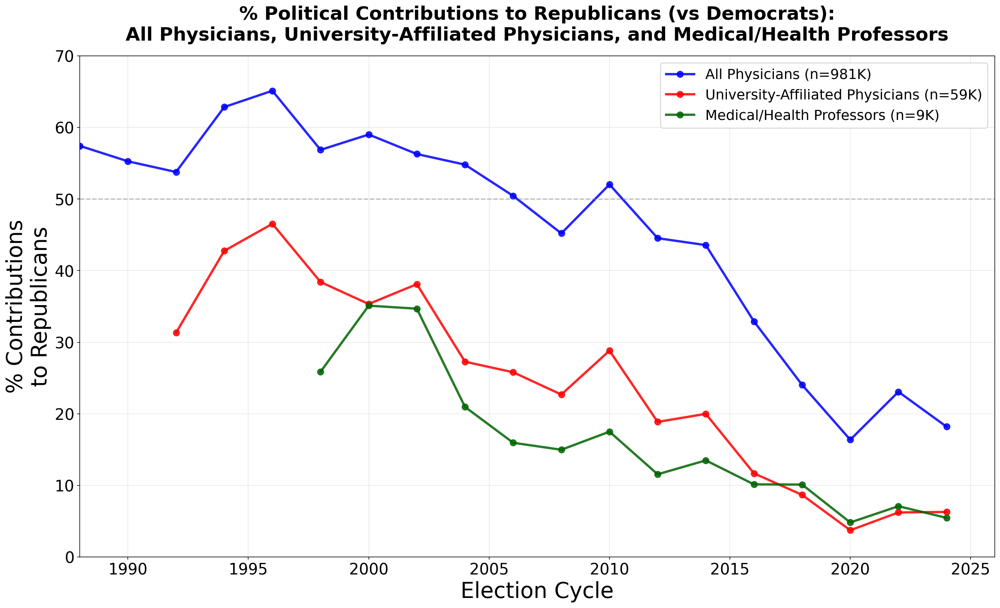

# Physician Political Donations (1980-2024)

[](https://www.python.org/downloads/)
[](https://opensource.org/licenses/MIT)

**How have physician political contributions changed over the past 45 years?**

This repository provides data and code to replicate figures showing the dramatic shift in physician political donations from majority-Republican in the 1980s to majority-Democratic today.



## Key Findings

1. **Physicians overall** have shifted from giving **~65% to Republicans** in the 1980s to giving **~75-80% to Democrats** by 2018-2020. This represents one of the most dramatic partisan shifts of any professional group in American politics.

2. **University-affiliated physicians** are even more Democratic - giving only **~12% to Republicans** overall, compared to 36% for all physicians. By 2020, university-affiliated physicians gave just **4% to Republicans**.



## Quick Start (Pre-computed Data)

If you just want to generate the figures using our pre-computed data:

```bash
# Clone the repository
git clone https://github.com/kevinnbass/dime_donations_doctors.git
cd dime_donations_doctors

# Install dependencies
pip install -r requirements.txt

# Generate figures
python replicate_figure.py
```

Output figures will be saved to the `figures/` directory.

## Full Replication (From Raw DIME Data)

To replicate the entire analysis from scratch using raw DIME data:

### 1. Obtain DIME Data

Request access to the DIME database from Stanford University:
- **Website**: [data.stanford.edu/dime](https://data.stanford.edu/dime)
- Download the itemized contribution files (1980-2024)
- Place them in `data/raw/dime/`

### 2. Run the Pipeline

```bash
# Install all dependencies
pip install -r requirements.txt

# Run the full pipeline
python scripts/run_pipeline.py

# Or run individual steps
python scripts/run_pipeline.py --list          # List all steps
python scripts/run_pipeline.py --skip-to 34    # Skip to script 34
python scripts/run_pipeline.py --only 34       # Run only script 34
```

### Pipeline Steps

| Script | Description |
|--------|-------------|
| `00_streaming_ingest.py` | Download and process DIME contribution data |
| `01_ingest_data.py` | Ingest NPPES physician registry data |
| `02_build_physician_labels.py` | Build physician classification labels |
| `02b_add_cms_linkage.py` | Add CMS Medicare linkage (optional) |
| `02c_add_pecos_linkage.py` | Add PECOS enrollment data (optional) |
| `03_build_donor_panel.py` | Build donor-cycle panel |
| `34_yearly_contributions_by_pool.py` | Analyze yearly contributions |
| `35_academic_physicians.py` | Analyze academic physicians |

### System Requirements

- **Disk Space**: ~100GB for raw DIME data + processed files
- **Memory**: 8GB+ RAM recommended
- **Time**: Full pipeline takes several hours

## What This Shows

The figure plots the percentage of physician political contributions going to Republican candidates in each election cycle from 1980 to 2024. Key observations:

| Period | % Republican | Interpretation |
|--------|--------------|----------------|
| 1980s | ~60-70% | Physicians were solidly Republican |
| 1990s | ~55-65% | Slight Democratic shift begins |
| 2000s | ~50-60% | Approaching partisan parity |
| 2008 | ~40% | Obama election - major shift |
| 2010s | ~35-45% | Democrats become majority |
| 2018-2020 | ~15-20% | Lowest Republican share on record |
| 2022-2024 | ~25-35% | Modest Republican rebound |

## Methodology

### Data Source

All data comes from the **DIME (Database on Ideology, Money in Politics, and Elections)** maintained by Adam Bonica at Stanford University. DIME compiles Federal Election Commission (FEC) records of all political contributions over $200, which by law must include the donor's name, address, employer, and occupation.

**Website**: [data.stanford.edu/dime](https://data.stanford.edu/dime)

### How We Identify Physicians

We use **self-reported occupation** from FEC filings to identify physicians. Because people describe their jobs in different ways, we use multiple definitions and show that our results are robust across all of them:

| Definition | Description | Sample Size |
|------------|-------------|-------------|
| **Doctor/Physician Keyword** | Occupation contains "doctor" or "physician" | ~330K donations |
| **MD/DO Credential** | Occupation includes "MD", "M.D.", "DO", or "D.O." | ~21K donations |
| **Medical Specialists** | Occupation lists a specialty (surgeon, cardiologist, etc.) | ~57K donations |
| **CMS Medicare** | Matched to CMS Medicare billing records | ~235K donations |
| **Broad Physician Rules** | Comprehensive patterns with exclusions for non-physicians | ~686K donations |

All five definitions produce **highly correlated results** (r > 0.92), indicating the trend is robust to how we define "physician."

### How We Measure Partisanship

For each donation, we determine whether the recipient was a Republican or Democratic candidate. We then calculate:

```
Republican Share = Republican Donations / (Republican + Democratic Donations)
```

This is calculated at the **election cycle level** (each even year), aggregating all donations from physicians in that year.

### Important Notes

1. **This is contribution-weighted, not donor-weighted**: A physician who donates $10,000 to Republicans counts more than one who donates $100.

2. **These are all donations, not just new donors**: Unlike cohort analyses that track when donors first appear, this shows total giving in each year.

3. **CMS Medicare data only goes through 2018**: The CMS-matched pool stops earlier because we haven't yet linked newer Medicare data.

## Repository Structure

```
dime_donations_doctors/
├── README.md                 # This file
├── METHODOLOGY.md            # Detailed methodology explanation
├── requirements.txt          # Python dependencies
├── LICENSE                   # MIT License
├── setup.py                  # Package installation
│
├── replicate_figure.py       # Quick: Generate figures from pre-computed data
│
├── scripts/                  # Full pipeline scripts
│   ├── run_pipeline.py       # Orchestrator - runs all scripts
│   ├── 00_streaming_ingest.py
│   ├── 01_ingest_data.py
│   ├── 02_build_physician_labels.py
│   ├── 02b_add_cms_linkage.py
│   ├── 02c_add_pecos_linkage.py
│   ├── 03_build_donor_panel.py
│   ├── 34_yearly_contributions_by_pool.py
│   └── 35_academic_physicians.py
│
├── src/                      # Supporting modules
│   ├── config.py             # Path configuration
│   ├── streaming_ingest.py   # DIME data processing
│   └── ...                   # Other processing modules
│
├── config/                   # Configuration files
│   └── keyword_rules.yaml    # Physician classification rules
│
├── data/                     # Pre-computed outputs (for quick replication)
│   ├── yearly_contributions_by_pool.csv
│   ├── academic_physicians_full.csv
│   └── academic_physicians_donor_weighted.csv
│
└── figures/
    ├── physician_contributions_by_cycle.png
    ├── physician_contributions_no_specialists.png
    └── academic_vs_all_physicians.png
```

## Data Dictionary

The file `data/yearly_contributions_by_pool.csv` contains:

| Column | Type | Description |
|--------|------|-------------|
| `cycle` | int | Election year (1980, 1982, ..., 2024) |
| `n_donations` | int | Number of donation records |
| `total_dollars` | float | Total dollar amount contributed |
| `avg_party_score` | float | Average party score (-1=Rep, +1=Dem) |
| `rep_share` | float | Fraction to Republicans (0 to 1) |
| `rep_dollars` | float | Dollars to Republican candidates |
| `dem_dollars` | float | Dollars to Democratic candidates |
| `rep_donations` | int | Count of Republican donations |
| `dem_donations` | int | Count of Democratic donations |
| `pool` | str | Physician definition identifier |
| `pool_name` | str | Human-readable pool name |

## Citation

This analysis extends:

> Bonica, A., Rosenthal, H., Rothman, D. J., & Blackford, K. (2019). The Political Polarization of Physicians in the United States. *JAMA Internal Medicine*, 179(12), 1688-1694. https://doi.org/10.1001/jamainternmed.2019.4126

The original study analyzed data through 2015. This repository extends the analysis through 2024.

## Related Work

- **Original DIME Database**: Bonica, A. (2016). Database on Ideology, Money in Politics, and Elections. Stanford University Libraries. https://data.stanford.edu/dime

- **DIME Methodology**: Bonica, A. (2014). Mapping the Ideological Marketplace. *American Journal of Political Science*, 58(2), 367-386.

## License

This project is licensed under the MIT License - see the [LICENSE](LICENSE) file for details.

## Questions?

Open an issue on this repository or contact the maintainer.
